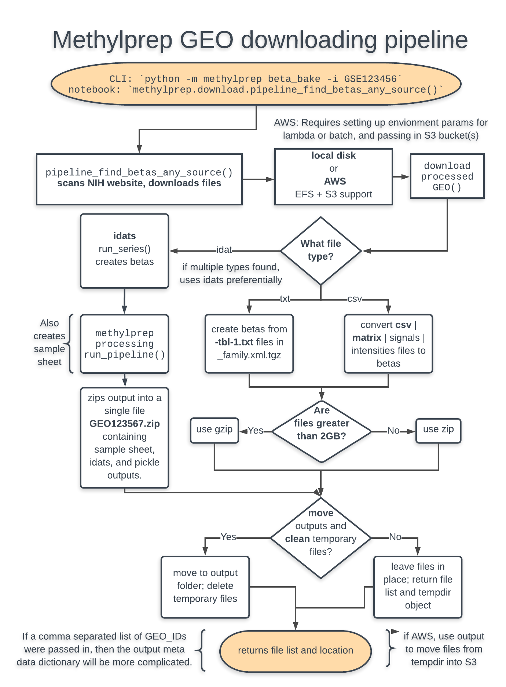
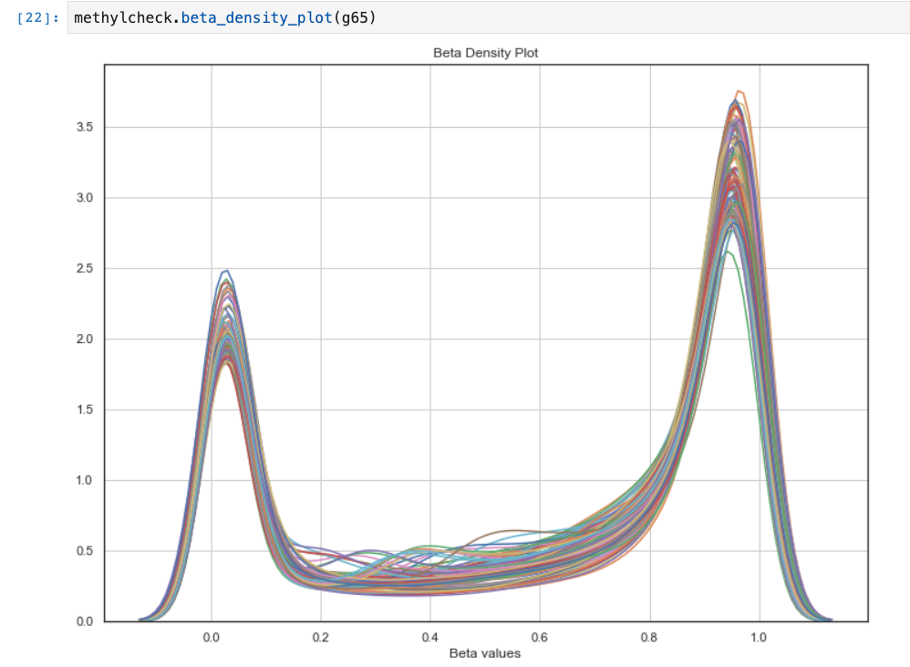

# Public GEO datasets

`methylprep` provides methods to use public data in a variety of formats. These command-line
interface methods include `download`, `meta_data`, `composite`, `alert` and the wrapper
function `beta_bake`. The source for these data sets is the NIH GEO Omnibus at
https://www.ncbi.nlm.nih.gov/geo/.

Example:
```Shell
(base) $ python -m methylprep beta_bake -i GSE123211 -d GEO/GSE123211
```

You can download and convert files in a variety of formats, and later load them
using `methylcheck.load`.
- `idat` (preferred format, as it contains everything saved from the array processing machine)
- processed tab delimited (`txt`)
- processed `csv`
- processed `xlsx`
- if any GEO files contains one or more of these keywords: `['matrix', 'processed', 'signals', 'intensities', 'normalized', 'intensity', 'raw_data', 'mean', 'average', 'beta']`
- pickled dataframes (`pkl`) created using `methylprep process` or `methylprep.run_pipeline`
  - format: dataframe should have probe names as columns or rows, and sample probe values in the other dimension.
  - meta data: as a dataframe with values for samples, so long as one of those characteristics, the sample name, matches the Sentrix_Position sample name that is the default output of Illumina arrays.
  - Note: if you use `methylprep.load_both` and pass in the folder location of your methylprep processed data, it will construct the meta data frame for you. Ultimately, it is reading the GEO `miniml` format (XML) file for the public data set, or your samplesheet if you provided one.

### downloading from GEO with `beta_bake`
Version 1.3.0 and greater contains one all-encompassing pipeline function (`beta_bake`) for downloading and parsing NIH GEO methylation data sets in a variety of formats, returning a python 3x pickled dataframe of probe beta_values for each sample in a published batch. The internal workflow is messy, but all you need is the
GEO accession number in the format of `GSExxxxxx` where `x` is some number.
You can also use `methylprep alert -k <keyword>` to produce a CSV with all the search results and GEO IDs
you may want to run into this function.



```Shell
(base) $ python -m methylprep beta_bake -i GSE74013 -d GSE74013
INFO:methylprep.download.miniml:Downloading GSE74013_family.xml.tgz
INFO:methylprep.download.miniml:MINiML file does not provide (Sentrix_id_R00C00) for 24/24 samples.
INFO:methylprep.download.miniml:Final samplesheet contains 24 rows and 9 columns
```
Output file containing a beta_values pickled dataframe: GSE74013_beta_values.pkl.gz
Output file containing meta data: GSE74013_GPL13534_meta_data.pkl.gz

You can also access parts of the beta_bakery pipeline individually.

```Shell
(base) $ python -m methylprep download -i GSE122126 -d GEO/GSE122126
INFO:methylprep.download.geo:Downloading GSE122126_family.xml
GSE122126:   3%|█▉                                                            | 12.3M/407M [00:07<05:57, 1.10Mb/s]

INFO:methylprep.download.geo:Downloaded GSE122126_family.xml
INFO:methylprep.download.geo:Unpacking GSE122126_family.xml
GSE122126:   7%|████▎                                                          | 121M/1.77G [01:24<42:48, 644kb/s]

```

If you choose a dataset that lacks raw idat files, `methylprep download` will warn you.

```Shell
(base) $ python -m methylprep download -i GSE123211 -d GEO/GSE123211
ERROR:methylprep.download.process_data:[!] Geo data set GSE123211 probably does NOT contain usable raw data (in .idat format). Not downloading.
ERROR:methylprep.download.process_data:Series failed to download successfully.
```

However, if processed data exists for this data set and you use `beta_bake`, the beta bakery will download and convert GEO data for you into a higher-performance python format.

`methylcheck.read_geo`: If you prefer to download the author's processed data yourself, you can download the `.gz` file using a web browser, then `gunzip` it to create a `txt | pkl | xlsx | csv` file, and then load that using `methylprep.read_geo` or `methylcheck.read_geo`.

### loading processed GEO data

If you're using GEO data in its original format, there is a `read_geo()` function in methyl-suite that can
read most formats. This function is no longer necessary as of v1.3.0 because `beta_bake` will download and
convert these files into a more efficient format that you can read with `methylcheck.load`.

```python
import methylprep
import methylcheck
from pathlib import Path

df = methylprep.read_geo(Path('~/Downloads', 'GSE115278_Matrix_processed.txt'))
# or
df = methylprep.read_geo(Path('~/Downloads', 'GSE111165_data_processed_detection_p_val_EPIC.csv'))
methylcheck.beta_density_plot(df)
```



If you run `methylprep beta_bake` on the GEO series, the `.pkl` output files can be opened with
`pandas` as they are standard python dataframes.

```python
import pandas as pd
import methylcheck
betas = pd.read_pickle('GSE74013/GSE74013_beta_values.pkl')
methylcheck.sample_plot(betas)
```
