# how it works / tutorial

## Introduction

The goal of this tutorial is to present a standard analysis workflow of Infinium Methylation data with the **methylprep** and **methylcheck** packages. This tutorial is based off of the tutorial for the **minfi** package, a similar methylation analysis package implemented in R rather than python [[1]](#minfi).

We will begin with **methylprep** by reading input raw data (IDAT files) for each sample in an example dataset and end with a consolidated data frame containing all samples. We then use **methylcheck** to visualize the data and filter out problematic probes and samples.

The example data for this tutorial is available on [ReadTheDocs](https://life-epigenetics-methylprep.readthedocs-hosted.com/en/tutorial/index.html#), the `pip` webpages ([methylprep](https://pypi.org/project/methylprep/), [methylcheck](https://pypi.org/project/methylcheck/)), and the GitHub pages ([methylprep](https://github.com/LifeEGX/methylprep), [methylcheck](https://github.com/LifeEGX/methylcheck)).

### Array design and terminology
In this section, we introduce briefly the supported arrays as well as the terminology used throughout the **methylprep** and **methylcheck** packages. **methylprep** and **methylcheck** support 5 types of arrays: 27K[^](#27K), 450K, EPIC, EPIC+, and custom arrays. Each sample is measured on a single array, in two different color channels (red and green). Each array contains numerous probes where a given probe maps to a specfic CpG site. For each CpG, we have two measurements: a methylated intensity and an unmethylated intensity. Depending on the probe design, the signals are reported in different colors:

For **Type I** design, both signals are measured in the same color: one probe for the methylated signal and one probe for the unmethylated signal.

For **Type II** design, only one probe is used. The *Green* intensity measures the methylated signal, and the *Red* intensity measures the unmethylated signal.


**A. Infinium I assay:** Two bead types correspond to each CpG locus: one bead type — to methylated (C), another bead type — to unmethylated (T) state of the CpG site (as bisulfite conversion causes unmethylated cytosines to be detected as thymines). Probe design assumes same methylation status for adjacent CpG sites. Both bead types for the same CpG locus will incorporate the same type of labeled nucleotide, determined by the base preceding the interrogated “C” in the CpG locus, and therefore will be detected in the same color channel.
**B. Infinium II assay:** One bead type corresponds to each CpG locus. Probe can contain up to 3 underlying CpG sites, with degenerate R base corresponding to C in the CpG position. Methylation state is detected by single-base extension. Each locus will be detected in two colors. In the current version of the Infinium II methylation assay design, labeled “A” is always incorporated at unmethylated query site (“T”), and “G” is incorporated at methylated query site (“C”) [[2]](#infinium).

The 27K array measures more than 27,000 CpG positions, the 450K array measures more than 450,000, and the EPIC measures over 850,000. When processing an array, information about each probe is required from a manifest file corresponding to the array's type. While users can specify a manifest file to use, if none is provided the type of array is detected from the IDAT files and the corresponding manifest file is automatically retrieved. Custom arrays can be processed by **methylprep**, however users will have to provide their own manifest files. One example of a custom array that comes supported by **methylprep** is the EPIC+ array, a modification on the standard EPIC array designed by **Life Epigenetics** to include additional probes of interest to epigenetic researchers.

### Some definitions

Two common measures of methylation are **Beta values** and **M values** [[3]](#du). M values range from 0 to any number (they are unbounded), so they are more sensitive for statistical analysis (ie, no ceiling/floor effects), but they're impossible to interpret. Normalized M-values can be used for statistical analyses (see https://www.nature.com/articles/s41598-020-60758-0). Beta values are easier to understand, practically speaking. They range from 0 to 1, and represent the proportion of methylated CpG sites in the sample.

**Beta value:**


where *M* and *U* denote the methylated and unmethylated signals respectively.

**MValue:**


**NOOB** (Normal-exponential convolution using Out-Of-Band probes): a standard normalization technique for methylation data using out-of-band probes [[4]](#triche)

The following definitions are criteria to exclude probes in **methylcheck**:

- **Polymorphism**: genetic variation occuring in several forms among members of the same species. Relevant here when probes map to regions containing SNPs, which greatly confounds the detection of methylation levels for that CpG site [[5]](#chen)
- **Cross Hybridization**: the formation of double stranded DNA from complementary strands. Relevant here when probes hybridize different sections of DNA than they are intended to [[5]](#chen)
- **Base Color Change**: when a SNP occurs in the extension base such that the signal is recorded in the opposite color channel [[6]](#zhou)
- **Repeat Sequence Elements**: patterns of nucleic acids that occur in multiple copies throughout the genome. Probes which span regions containing repeats yield erroneous signals [[7]](#naeem)


## Setup

### Pip install

**methylprep** and **methylcheck** can be easily installed using `pip`, a popular package installer for `python`. For information on installing `pip`, visit their [website](https://pip.pypa.io/en/stable/installing/).

To install the two packages, simply run the following two commands.

```bash
$ pip install methylprep
$ pip install methylcheck
```

## methylprep

**methylprep** provides a command line interface (CLI) so the package can be used directly in bash/batchfile scripts as part of building your custom processing pipeline.


### process

A sample sheet is a CSV file that stores the information about a sequencing experiment and is required to run **methylprep**; this file must reside in the same directory as the IDAT files being processed. Each row of the sample sheet represents a different sample and must contain a `Sample_Name` column, a `Sentrix_ID` column, and a `Sentrix_Position` column (additional columns may be present). Visit [Illumina](https://support.illumina.com/downloads/infinium-methylationepic-sample-sheet.html) for an example of how to format a sample sheet file.

The `process` command processes the methylation data for all samples listed in the sample sheet of a given directory, creating a CSV file for each processed sample. Here we provide the minimum arguments for **methylprep** to run. The `-m` option followed by `methylprep` tells python to use the **methylprep** package. `process` is the command we are running. The `-d`option followed by the filepath of the sample directory tells the program where to look for sample files.

```bash
$ python3 -m methylprep process -d "docs/example_data/GSE69852/"
100%|██████████████████████████████████████████████████████████████████████████████████████████████████████████████████████████████████████████████████████████████| 2/2 [00:36<00:00, 18.08s/it]
```

The `process` command by default outputs each sample into its own CSV file. Each row of the CSV files contains one of the sample's probes and the columns are the probe's Illumina probe ID, NOOB adjusted methylated value, NOOB adjusted unmethylated value, M value, and Beta value.

There are situations when researchers want additional measures from array data. If they want to run the quality control analysis in the `methylcheck` package, they will need data from Illumina's internal control probes and the uncorrected fluorescence intensity, representing the ratio of methylated to unmethylated sites. The easiest way to collect everything is to ask for everything with the `--all` flag:

```bash
$ python3 -m methylprep process -d "path/to/example/GSE123456/" --all
100%|██████████████████████████████████████████████████████████████████████████████████████████████████████████████████████████████████████████████████████████████| 168/168 [51:36<00:00, 18.08s/it]
```

For the remaining **methylprep** examples we provide the `-v` option, which stands for verbose. This causes the program to output additional information about the processing of samples.

```bash
$ python3 -m methylprep -v process -d "docs/example_data/GSE69852/"
INFO:root:This will attempt to autodetect your methylation array_type and download the corresponding manifest file.
INFO:methylprep.processing.pipeline:Running pipeline in: docs/example_data/GSE69852
INFO:methylprep.files.sample_sheets:Searching for sample_sheet in docs/example_data/GSE69852
INFO:methylprep.files.sample_sheets:Found sample sheet file: docs/example_data/GSE69852/samplesheet.csv
INFO:methylprep.files.sample_sheets:Parsing sample_sheet
INFO:methylprep.processing.raw_dataset:Generating raw datasets from sample sheet: <methylprep.files.sample_sheets.SampleSheet object at 0x114265898>
INFO:root:Building samples
INFO:methylprep.files.manifests:Reading manifest file: <gzip _io.BufferedReader name='/Users/marktaylor/.methylprep_manifest_files/HumanMethylation450_15017482_v1-2.CoreColumns.csv.gz' 0x1145f14a8>
INFO:methylprep.files.manifests:Reading control probes from manifest file: <gzip _io.BufferedReader name='/Users/marktaylor/.methylprep_manifest_files/HumanMethylation450_15017482_v1-2.CoreColumns.csv.gz' 0x1145f14a8>
  0%|                                                                                                                                                                      | 0/2 [00:00<?, ?it/s]INFO:methylprep.processing.meth_dataset:Preprocessing methylation dataset: 9247377093_R02C01
INFO:methylprep.processing.meth_dataset:Preprocessing methylation dataset: 9247377093_R02C01
INFO:methylprep.processing.preprocess:Preprocessing methylation dataset using NOOB: 9247377093_R02C01
INFO:methylprep.processing.raw_dataset:Preprocessing Grn foreground datasets: 9247377093_R02C01
INFO:methylprep.processing.raw_dataset:Preprocessing Red foreground datasets: 9247377093_R02C01
INFO:methylprep.processing.raw_dataset:Preprocessing Grn foreground controls dataset: 9247377093_R02C01
INFO:methylprep.processing.raw_dataset:Preprocessing Red foreground controls dataset: 9247377093_R02C01
 50%|███████████████████████████████████████████████████████████████████████████████                                                                               | 1/2 [00:17<00:17, 17.45s/it]INFO:methylprep.processing.meth_dataset:Preprocessing methylation dataset: 9247377085_R04C02
INFO:methylprep.processing.meth_dataset:Preprocessing methylation dataset: 9247377085_R04C02
INFO:methylprep.processing.preprocess:Preprocessing methylation dataset using NOOB: 9247377085_R04C02
INFO:methylprep.processing.raw_dataset:Preprocessing Grn foreground datasets: 9247377085_R04C02
INFO:methylprep.processing.raw_dataset:Preprocessing Red foreground datasets: 9247377085_R04C02
INFO:methylprep.processing.raw_dataset:Preprocessing Grn foreground controls dataset: 9247377085_R04C02
INFO:methylprep.processing.raw_dataset:Preprocessing Red foreground controls dataset: 9247377085_R04C02
100%|██████████████████████████████████████████████████████████████████████████████████████████████████████████████████████████████████████████████████████████████| 2/2 [00:35<00:00, 17.51s/it]
INFO:methylprep.processing.pipeline:[!] Exported results (csv) to: {'docs/example_data/GSE69852/9247377093/9247377093_R02C01_processed.csv', 'docs/example_data/GSE69852/9247377085/9247377085_R04C02_processed.csv'}
```

Most filtering and quality control steps in **methylcheck** require a `pandas` data frame, where the rows contain different probes and the columns represent each of the samples. **methylprep** generates these dataframes, if the user appends either a `--betas` or `--m_value` argument to the `process` command.

```bash
$ python3 -m methylprep -v process -d "docs/example_data/GSE69852/" --betas
INFO:root:This will attempt to autodetect your methylation array_type and download the corresponding manifest file.
INFO:methylprep.processing.pipeline:Running pipeline in: docs/example_data/GSE69852
INFO:methylprep.files.sample_sheets:Searching for sample_sheet in docs/example_data/GSE69852
INFO:methylprep.files.sample_sheets:Found sample sheet file: docs/example_data/GSE69852/samplesheet.csv
INFO:methylprep.files.sample_sheets:Parsing sample_sheet
INFO:methylprep.processing.raw_dataset:Generating raw datasets from sample sheet: <methylprep.files.sample_sheets.SampleSheet object at 0x114c9ee10>
INFO:root:Building samples
INFO:methylprep.files.manifests:Reading manifest file: <gzip _io.BufferedReader name='/Users/marktaylor/.methylprep_manifest_files/HumanMethylation450_15017482_v1-2.CoreColumns.csv.gz' 0x114cb0a20>
INFO:methylprep.files.manifests:Reading control probes from manifest file: <gzip _io.BufferedReader name='/Users/marktaylor/.methylprep_manifest_files/HumanMethylation450_15017482_v1-2.CoreColumns.csv.gz' 0x114cb0a20>
  0%|                                                                                                                                                                      | 0/2 [00:00<?, ?it/s]INFO:methylprep.processing.meth_dataset:Preprocessing methylation dataset: 9247377093_R02C01
INFO:methylprep.processing.meth_dataset:Preprocessing methylation dataset: 9247377093_R02C01
INFO:methylprep.processing.preprocess:Preprocessing methylation dataset using NOOB: 9247377093_R02C01
INFO:methylprep.processing.raw_dataset:Preprocessing Grn foreground datasets: 9247377093_R02C01
INFO:methylprep.processing.raw_dataset:Preprocessing Red foreground datasets: 9247377093_R02C01
INFO:methylprep.processing.raw_dataset:Preprocessing Grn foreground controls dataset: 9247377093_R02C01
INFO:methylprep.processing.raw_dataset:Preprocessing Red foreground controls dataset: 9247377093_R02C01
 50%|███████████████████████████████████████████████████████████████████████████████                                                                               | 1/2 [00:18<00:18, 18.96s/it]INFO:methylprep.processing.meth_dataset:Preprocessing methylation dataset: 9247377085_R04C02
INFO:methylprep.processing.meth_dataset:Preprocessing methylation dataset: 9247377085_R04C02
INFO:methylprep.processing.preprocess:Preprocessing methylation dataset using NOOB: 9247377085_R04C02
INFO:methylprep.processing.raw_dataset:Preprocessing Grn foreground datasets: 9247377085_R04C02
INFO:methylprep.processing.raw_dataset:Preprocessing Red foreground datasets: 9247377085_R04C02
INFO:methylprep.processing.raw_dataset:Preprocessing Grn foreground controls dataset: 9247377085_R04C02
INFO:methylprep.processing.raw_dataset:Preprocessing Red foreground controls dataset: 9247377085_R04C02
100%|██████████████████████████████████████████████████████████████████████████████████████████████████████████████████████████████████████████████████████████████| 2/2 [00:36<00:00, 18.53s/it]
INFO:methylprep.processing.pipeline:saved beta_values.pkl
```

```bash
$ python3 -m methylprep -v process -d "docs/example_data/GSE69852/" --m_value
INFO:root:This will attempt to autodetect your methylation array_type and download the corresponding manifest file.
INFO:methylprep.processing.pipeline:Running pipeline in: docs/example_data/GSE69852
INFO:methylprep.files.sample_sheets:Searching for sample_sheet in docs/example_data/GSE69852
INFO:methylprep.files.sample_sheets:Found sample sheet file: docs/example_data/GSE69852/samplesheet.csv
INFO:methylprep.files.sample_sheets:Parsing sample_sheet
INFO:methylprep.processing.raw_dataset:Generating raw datasets from sample sheet: <methylprep.files.sample_sheets.SampleSheet object at 0x1161cdeb8>
INFO:root:Building samples
INFO:methylprep.files.manifests:Reading manifest file: <gzip _io.BufferedReader name='/Users/marktaylor/.methylprep_manifest_files/HumanMethylation450_15017482_v1-2.CoreColumns.csv.gz' 0x1161de4e0>
INFO:methylprep.files.manifests:Reading control probes from manifest file: <gzip _io.BufferedReader name='/Users/marktaylor/.methylprep_manifest_files/HumanMethylation450_15017482_v1-2.CoreColumns.csv.gz' 0x1161de4e0>
  0%|                                                                                                                                                                      | 0/2 [00:00<?, ?it/s]INFO:methylprep.processing.meth_dataset:Preprocessing methylation dataset: 9247377093_R02C01
INFO:methylprep.processing.meth_dataset:Preprocessing methylation dataset: 9247377093_R02C01
INFO:methylprep.processing.preprocess:Preprocessing methylation dataset using NOOB: 9247377093_R02C01
INFO:methylprep.processing.raw_dataset:Preprocessing Grn foreground datasets: 9247377093_R02C01
INFO:methylprep.processing.raw_dataset:Preprocessing Red foreground datasets: 9247377093_R02C01
INFO:methylprep.processing.raw_dataset:Preprocessing Grn foreground controls dataset: 9247377093_R02C01
INFO:methylprep.processing.raw_dataset:Preprocessing Red foreground controls dataset: 9247377093_R02C01
 50%|███████████████████████████████████████████████████████████████████████████████                                                                               | 1/2 [00:20<00:20, 20.48s/it]INFO:methylprep.processing.meth_dataset:Preprocessing methylation dataset: 9247377085_R04C02
INFO:methylprep.processing.meth_dataset:Preprocessing methylation dataset: 9247377085_R04C02
INFO:methylprep.processing.preprocess:Preprocessing methylation dataset using NOOB: 9247377085_R04C02
INFO:methylprep.processing.raw_dataset:Preprocessing Grn foreground datasets: 9247377085_R04C02
INFO:methylprep.processing.raw_dataset:Preprocessing Red foreground datasets: 9247377085_R04C02
INFO:methylprep.processing.raw_dataset:Preprocessing Grn foreground controls dataset: 9247377085_R04C02
INFO:methylprep.processing.raw_dataset:Preprocessing Red foreground controls dataset: 9247377085_R04C02
100%|██████████████████████████████████████████████████████████████████████████████████████████████████████████████████████████████████████████████████████████████| 2/2 [00:41<00:00, 20.64s/it]
INFO:methylprep.processing.pipeline:saved m_values.pkl
```

The `--uncorrected` and `--save_control` flags work the same way, generating `unmeth_values.pkl`, `meth_values.pkl` and `control_probes.pkl` pickled pandas dataframes in the working folder, respectively. Also, the processed `csv` files will contain these additional columns for each sample. The output appears in two formats and two places to ensure that it can be exported into any format (via the CSV) and be further processed and analyzed using the most efficient high-performance data format (in this case, a pickled dataframe of numpy arrays).

#### file outputs and loading

The processed data is saved as a python pickle `pkl` file, which can be loaded in **methylcheck**. We recommend using pickled dataframes instead of `csv`s or numpy arrays because the structure efficiently tracks meta data and allows functions to perform matrix operations on the whole array faster. [DataFrames](https://pandas.pydata.org/pandas-docs/stable/getting_started/dsintro.html) are support both by python's `pandas`) and `R`'s' `tidyverse`.

Some large series of samples have caused **methylprep** to fail when available memory runs out. To avoid this, **methylprep** automatically turns on "batch processing" when there are more than 200 samples.  If your computer has very little memory (4GB of RAM or less), you may need to run **methylprep process** with the `--batch_size` option set to something lower, like 25 samples. If you encounter any issues, please let us know by adding an issue to our [GitHub](https://github.com/LifeEGX/methylprep/issues).

The effect of running samples in small batches is that you get several dataframe pickles as output. To recombine them for analysis, use `methylprep.load` instead of the usual `pandas` function:

```python
# for a single file, use this:
import pandas as pd
df = pd.read_pickle(<filename>)

# for batches of samples, use this:
import methylprep
df = methylprep.load(<path_to_files>)

# for processed samples saved as `csv`s, use this:
import methylprep
df = methylprep.load(<path_to_csv_files>)
```

#### advanced options

For additional arguments for `process`, or more information on the structure of **methylprep**'s classes, and a guide to manually processing data using internal functions, see the **[Developers Notes section](https://life-epigenetics-methylprep.readthedocs-hosted.com/en/latest/docs/methylprep_tutorial.html#developers-notes)]**.


## `methylcheck` command line interface (CLI)

Efficient and reliable quality control is important. The **methylcheck** package can be used to perform quality control and interactively visualize processed samples, either using the command line or a Jupyter Notebook. If you are only interesed in using a Jupyter Notebook for quality control, skip to the [next section](#JN).

**methylcheck** features one CLI command where various arguments dictate how the program runs. Users must specify at least two arguements, `-d` followed by the path of the data file to load and `-a` followed by the array type of that data file. By default, all quality control plots are run. For each plot, a PNG image is shown on the screen. For detailed information about each plot, see the next section: [Jupyter Notebook](#JN).

Here we use a data frame created from the GSE69852 samples provided with **methylprep** (produced by running `python3 -m methylprep -v process -d "docs/example_data/GSE69852/" --betas`).

```bash
$ python3 -m methylcheck -d beta_values.pkl -a '450k'
```

Mean Beta Plot

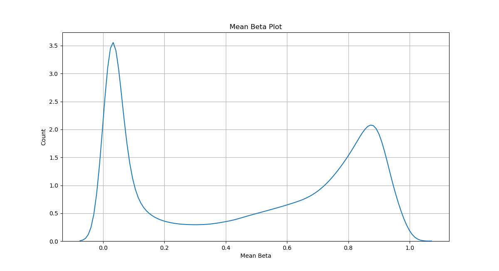

Beta Density Plot

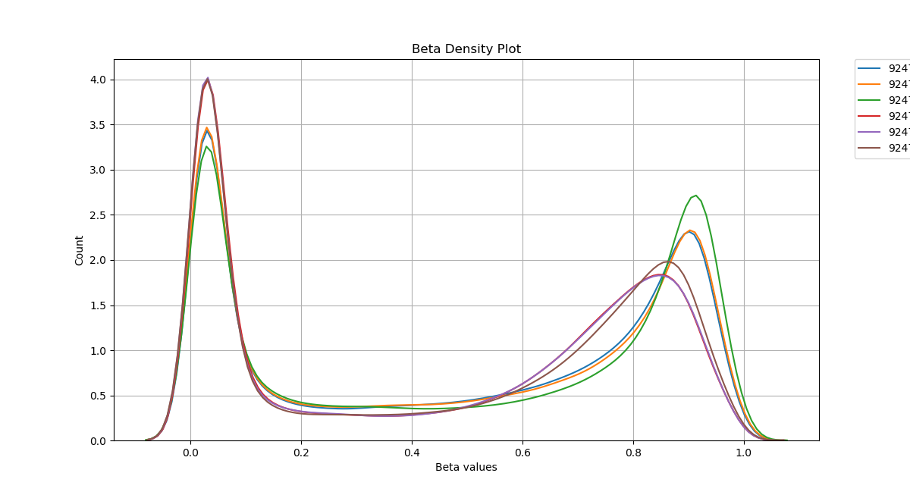

```python
Calculating area under curve for each sample.
6it [00:00,  9.52it/s]
```

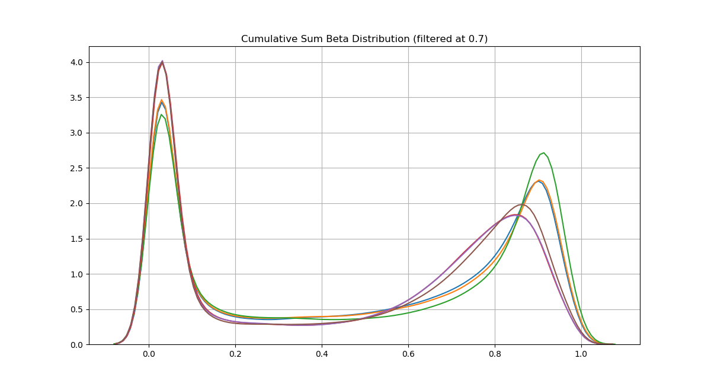

MDS Plot (outlier detection)

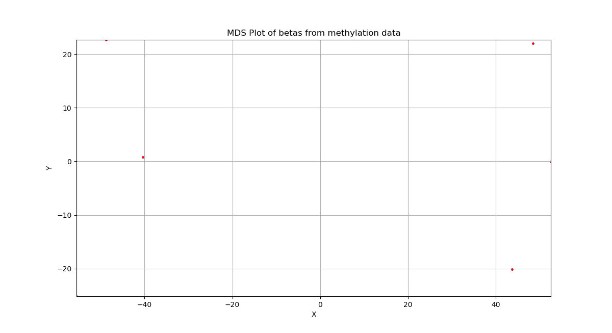

```python
Original samples (6, 2) vs filtered (6, 2)
Your scale factor was: 1.5
Enter new scale factor, <enter> to accept and save:
```

To specify a specific plot, include the `-p` switch followed by the desired plot chosen from the following: `mean_beta_plot`, `beta_density_plot`, `cumulative_sum_beta_distribution`, `beta_mds_plot`, or `all` (all of which are covered in detail in the next section: [Jupyter Notebook](#JN)). Note that while all plot functions have beta in the title, they are also used to plot M value data frames.

```bash
$ python3 -m methylcheck -d beta_values.pkl -a '450k' -p mean_beta_plot
```


Users can also specify which probes should be removed. To exclude sex probes, control probes, or probes that have been identified as problematic, provide the `--exclude_sex`, `--exclude_control`, or `--exclude_probes` arguments respectively. To remove all of the aforementioned probes, use `--exclude_all`.

```bash
$ python3 -m methylcheck -d beta_values.pkl -a '450k' -p mean_beta_plot --exclude_sex
```

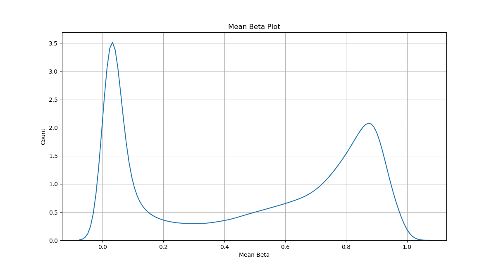

Here, we add the `--verbose` flag to get additional information about `methylcheck` as it runs, which can be utilized for every plot.

```bash
$ python3 -m methylcheck -d beta_values.pkl --verbose -a '450k' -p mean_beta_plot --exclude_all
Array 450k: Removed 11648 sex linked probes and 916 internal control probes from 6 samples. 473864 probes remaining.
Discrepancy between number of probes to exclude (12564) and number actually removed (11648): 916
It appears that your sample had no control probes, or that the control probe names didn't match the manifest (450k).
Of 473864 probes, 334500 matched, yielding 139364 probes after filtering.
```

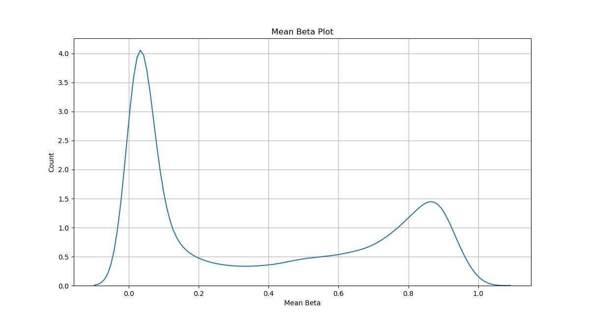

For all plots a PNG image is shown on the screen. To save this image to disk, include `--save`. We also use the `--silent` flag here to supress the PNG image from being shown on the screen (which also suppresses progress bars from being displayed).

```bash
$ python3 -m methylcheck -d beta_values.pkl -a '450k' -p mean_beta_plot --save --silent
```

<a name="JN"></a>
## `methylcheck` in Jupyter Notebook

While **methylcheck** is usable from the command line, users will likely prefer performing quality control in a notebook. ReadTheDocs contains several example notebooks, which we will step through here.

### starting a notebook

To open a Jupyter Notebook, simply run the command: `jupyter notebook`. This will open a browser window where users can look for Jupyter Notebooks to open (files with the `.ipynb` extension). For more information on running Jupyter Notebook's, take a look at their [documentation](https://jupyter-notebook-beginner-guide.readthedocs.io/en/latest/execute.html).

Here we process some example data from **methylprep**, loading in the `.pkl` file as follows.

```python
>>> import pandas as pd
>>> betas = pd.read_pickle("docs/example_data/beta_values.pkl")
```

An equivalent way to do this in a Jupyter notebook would be to use the .load()` function. This is necessary if you processed a large dataset or used the --batch-size option, which creates several files as output. `methylprep.load(<some path>)` or `methylprep.load_both(<some path>)` will recursively locate these files and combine them into one dataset for you.

```python
import methylprep
import methylcheck
df = methylprep.load('/myfiles_path')
# pr
df, meta_df = methylprep.load_both('path_to_files')
```

We can also process raw data using **methylprep** in a Jupyter Notebook (circumventing the `process` command). The `run_pipeline` function loads in and processes all of the samples in a given directory (the `process` CLI command uses `run_pipeline`). Like `process`, `run_pipeline` takes in the data directory as input and by default returns a list of `SampleDataContainer`s. **methylcheck** requires a `pandas` data frame where the rows contain the probes and each column represents a sample. By specifying `betas=True`, `run_pipeline` returns such a data frame with beta values.

```python
>>> import os
>>> import methylprep
>>> os.chdir('/Users/mmaxmeister/legx/methylprep')
>>> data_dir = 'docs/example_data/GSE69852'
>>> betas = methylprep.run_pipeline(data_dir, betas=True)
100%|██████████| 2/2 [00:19<00:00,  9.97s/it]
>>> betas.head()
  9247377093_R02C01 9247377085_R04C02
IlmnID    
cg00035864  0.236234  0.308176
cg00061679  0.427194  0.525169
cg00063477  0.929039  0.932739
cg00121626  0.481058  0.330045
cg00223952  0.044029  0.022201
```

M values can also be returned by specifying `m_value=True`.

```python
>>> m_values = methylprep.run_pipeline(data_dir, m_value=True)
```

Now that we have a workable data frame we can visualize our samples. `beta_density_plot` shows the density distribution of beta values for each sample (each sample is a different line) while `mean_beta_plot` shows the density distribution of average beta values.

```python
>>> import methylcheck
>>> methylcheck.beta_density_plot(betas)
```

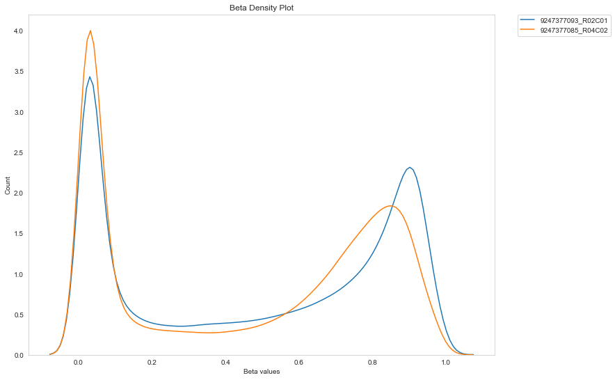

```python
>>> methylcheck.mean_beta_plot(betas)
```

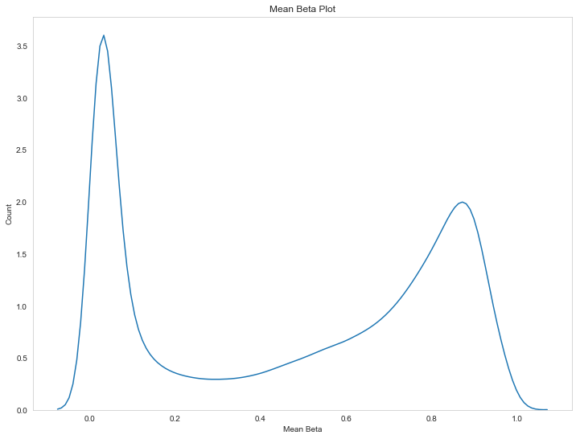

#### Filtering by Probes

**methylprep** enables users to remove various probes from their data in two ways. Here we load in the example data provided with **methylcheck**.

```python
>>> import methylprep
>>> baseDir = "docs/example_data/GSE69852/"
>>> df = methylprep.run_pipeline(baseDir, betas=True)
```

Some probes have been noted in the literature to be problematic for various reaons, such as probes that have polymorphisms, cross-hybridization, repeat sequence elements, or base color changes. These probes can be filtered out using the `list_problem_probes` and `exclude_probes` functions. `list_problem_probes` returns a list of probes to be excluded for the given array, and `exclude_probes` excludes the listed probes from the inputed data frame. Users can filter out probes listed to be problematic in given publications or according to the reason they are problematic. Here, we exclude 450K probes that are either listed to be problematic in `Chen2013`[[5]](#chen) or are known to correspond to polymorphic CpG sites.

The publications listing probes for exclusion from 450K arrays are `Chen2013`[[5]](#chen), `Price2013`[[8]](#price), `Naeem2014` [[7]](#naeem), `Daca-Roszak2015`[[9]](#daca-roszak) and those for EPIC arrays are `Zhou2016`[[6]](#zhou) and `McCartney2016`[[10]](#mccartney). The criteria for exclusion are `Polymorphism`, `CrossHybridization`, `BaseColorChange`, `RepeatSequenceElements`. Note: users can remove probes listed in a publication to be problematic for one array from a data frame of a different array type, however this leads to poor filtering and is not advised.

```python
>>> sketchy_probes_list = methylcheck.list_problem_probes('450k', ['Chen2013','Polymorphism'])
>>> df2 = methylcheck.exclude_probes(df, sketchy_probes_list)
Of 485512 probes, 290858 matched, yielding 194654 probes after filtering.
```

After we have removed probes from our data frame, we can use `mean_beta_compare` to visualize the difference removing problem probes has made. The blue curve is the original plot and the orange is the new plot.

```python
>>> methylcheck.mean_beta_compare(df,df2)
```

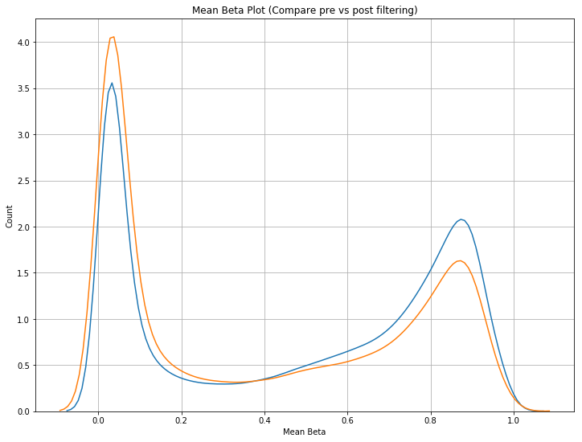

If no list of publications or criteria for exclusion is provided, all are excluded for that array type by default.

```python
>>> sketchy_probes_list = methylcheck.list_problem_probes('450k')
>>> df3 = methylcheck.exclude_probes(df, sketchy_probes_list)
>>> methylcheck.mean_beta_compare(df,df3)
Of 485512 probes, 341057 matched, yielding 144455 probes after filtering.
```

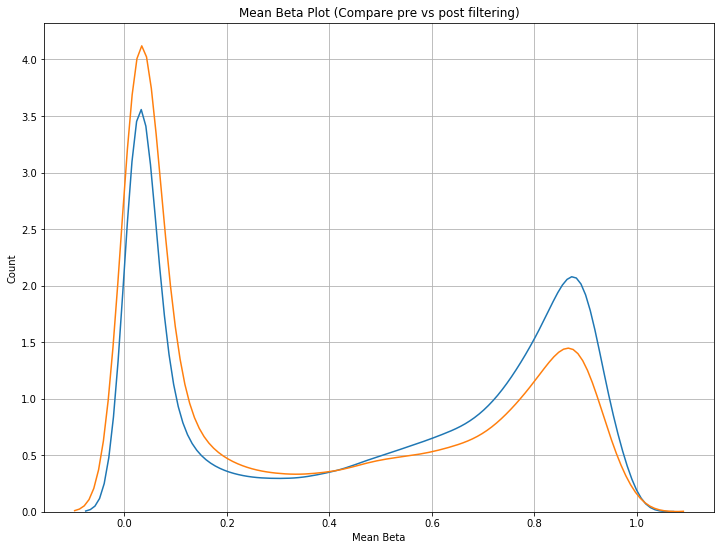

```python
>>> methylcheck.beta_density_plot(df3)
```

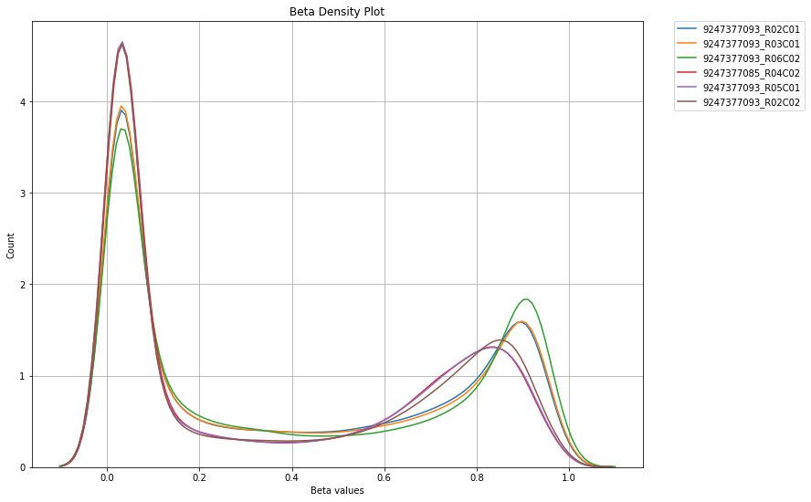

If zero probes are excluded when the user attempts to filter out probes, the probes are likely not named properly (which causes the message below to be displayed). This issue can occur when users attempt to use custom arrays that name probes differently. To alleviate, ensure you have specified the custom manifest file for your array.

```python
Discrepancy between number of probes to exclude (20892) and number actually removed (0): 20892
This happens when probes are present multiple times in array, or the manifest doesn’t match the array (EPIC+).
```

Sex linked probes (probes targeting the X or Y chromosomes) and control probes (internal Illumina probes used for quality control) are oftentimes removed. Users can remove both of these probes from data frames using `exclude_sex_control_probes`. The array type must be specified and users can optionally enable exclusion of sex and or control probes (both are removed by default).

```python
>>> filted_probes = methylcheck.exclude_sex_control_probes(df, '450k', no_sex=True, no_control=True, verbose=False)
```


#### Visual Filtering Functions

Functions that visually show the distribution of beta values are useful for removing outlier samples; here, we demonstrate these functions by loading in the full GEO `GSE100850` EPIC dataset and removing bad samples using the visual filtering functions. Note how `detect_array` can auto detect the array type from the data frame.

```python
>>> import pandas as pd
>>> import methylcheck
>>> df = pd.read_pickle("docs/example_data/beta_values.pkl")
>>> print(methylcheck.detect_array(df))
EPIC
```

Now we filter out problem probes and visualize our samples.

```python
>>> df = methylcheck.exclude_sex_control_probes(df, 'EPIC', verbose=True)
Array EPIC: Removed 19627 sex linked probes and 695 internal control probes from 39 samples. 846232 probes remaining.
Discrepancy between number of probes to exclude (20322) and number actually removed (19627): 695
It appears that your sample had no control probes, or that the control probe names didn't match the manifest (EPIC).
>>> sketchy_probes = methylcheck.list_problem_probes('EPIC')
>>> filtered = methylcheck.filters.exclude_probes(df, sketchy_probes)
Of 846232 probes, 381361 matched, yielding 464871 probes after filtering.
>>> methylcheck.beta_density_plot(df)
```

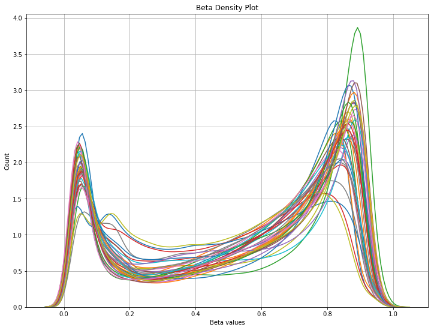

Multidimensional scaling is a technique to measure the level of simularity between samples. Any samples that are found to be a specified number of standard deviations away from the mean of samples are filtered out; by default `filter_stdev=1.5`, which is known as the scaling factor. `beta_mds_plot` returns a data frame with the retained samples, as well as a data frame containing those to be removed. The MDS plot is shown to visualize how similar samples are; retained samples are plotted in red and removed are in blue.

```python
>>> mds_filtered, mds_excluded = methylcheck.beta_mds_plot(betas, filter_stdev=1.5)
Your data needed to be transposed (df = df.transpose()).
(39, 846232)
Making sure that probes are in columns (the second number should be larger than the first).
Starting MDS fit_transform. this may take a while.
You can now remove outliers based on their transformed beta values
 falling outside a range, defined by the sample standard deviation.
Your acceptable value range: x=(-100.0 to 100.0), y=(-93.0 to 93.0).
```

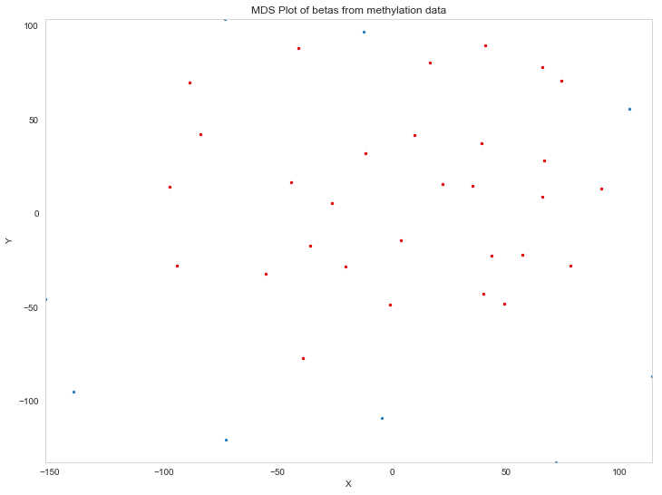

```python
Original samples (39, 2) vs filtered (30, 2)
Your scale factor was: 1.5
Enter new scale factor, <enter> to accept and save:
```

After the MDS plot is shown, users can optionally input a new scaling factor or accept the results. Note how both peaks have moved apart, which is the intended effect.

```python
methylcheck.mean_beta_compare(df, mds_filtered)
```

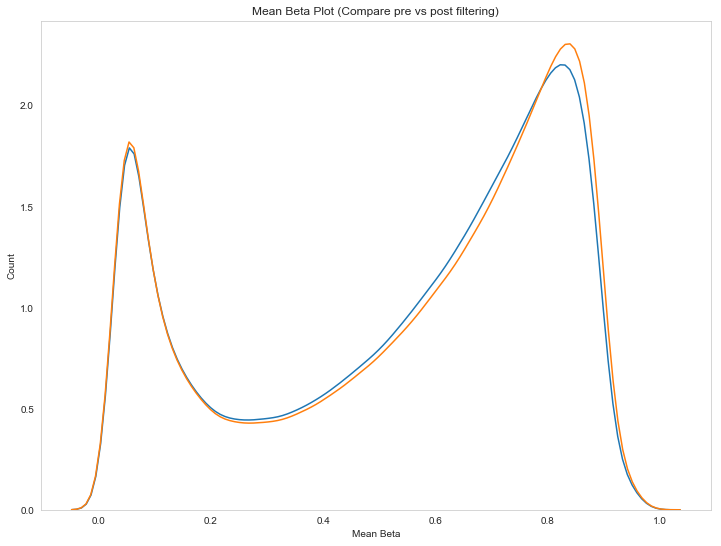


To further filter outlier samples, `cumulative_sum_beta_distribution` returns a data frame where samples are removed to maintain the area under the beta distribution curve below some cutoff value (`cutoff=0.7` by default). The filtered density distributions are plotted, unless `plot=False` is specified.

```python
>>> df_outliers_removed = methylcheck.cumulative_sum_beta_distribution(mds_filtered, cutoff=0.5)
Calculating area under curve for each sample.
```

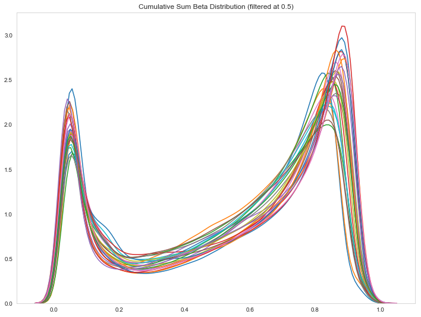


We now compare our final filtered data frame to the original one. Note how both peaks have moved further apart after applying cumulative sum filtering to our MDS filtered data.

```python
>>> methylcheck.mean_beta_compare(df, df_outliers_removed, verbose=True)
```

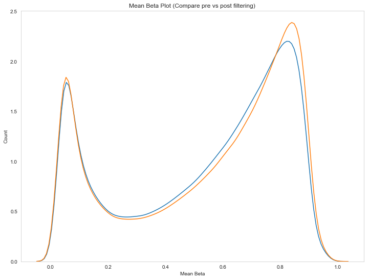

While these improvements may seem marginal, the more samples in a dataset the more effective filtering will be. Below is the curve before and after filtering for a dataset with hundreds of samples, where improvements are much more evident.

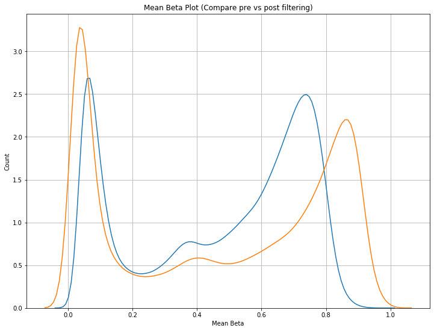


## Developers Notes

**methylprep** contains a number of classes corresponding to various transformations of the raw data. If you want to extend or customize methylprep, it is important to understand how these classes relate to each other.

### Additional arguments for process CLI

**methylprep** has a few more optional arguments.
* If users do not have a sample sheet, they can include `--no_sample_sheet` as an argument to create one with arbitrary samples names (i.e. Sample_1, Sample_2, etc.).
* To specify the type of array being processed, they can include `-a` or `--array_type` followed by the type of array (`27k`, `450k`, `epic`, `epic+`, or `custom`).
* To specify the file path of the manifest or sample sheet, include `-m`/`--manifest` or `s`/`--sample_sheet` respectively followed by the file path of the manifest or sample sheet file.
* To specify the names of samples to run, include `n` or `--sample_name` followed by a list of sample names to process.
* To supress **methylprep** from exporting, include `e` or `--no_export`

### sample_sheet CLI

The `sample_sheet` command finds and parses the sample sheet in a given directory and emits the details of each sample. Users can use this command to verify their sample sheets are formatted correctly.

```bash
$ python3 -m methylprep -v sample_sheet -d docs/example_data/GSE69852
INFO:methylprep.files.sample_sheets:Generating sample sheet
INFO:methylprep.files.sample_sheets:Searching for sample_sheet in docs/example_data/GSE69852
INFO:methylprep.files.sample_sheets:Found sample sheet file: docs/example_data/GSE69852/samplesheet.csv
INFO:methylprep.files.sample_sheets:Parsing sample_sheet
INFO:root:Building samples
9247377093_R02C01
9247377085_R04C02
```

### Reading Data

In addition to the CLI, **methylprep** can be used as a standard python package. The `run_pipeline` function loads in and processes all of the samples in a given directory and is called by the `process` CLI command. The function returns a list of `SampleDataContainer` objects corresponding to each sample in the inputted directory, although the user can optionally export processed CSV files, like `process`. To view the `SampleDataContainer`s processed data, access its data_frame like below. Here, we will load and process the dataset containing 2 samples from the **methylprep** package:

```python
>>> from methylprep import run_pipeline
>>> baseDir = "docs/example_data/GSE69852/"
>>> data_container = run_pipeline(baseDir)
100%|██████████████████████████████████████████████████████████████████████████████████████████████████████████████████████████████████████████████████████████████████████████████| 2/2 [00:26<00:00, 13.35s/it]
>>> data_container
[<methylprep.processing.pipeline.SampleDataContainer object at 0x1209b3b70>, <methylprep.processing.pipeline.SampleDataContainer object at 0x1209ce7f0>]
>>> data_container[0]._SampleDataContainer__data_frame[0:4]
              noob_meth  noob_unmeth   m_value  beta_value
IlmnID                                                    
cg00035864  1305.138844  4119.633579 -1.657558    0.236234
cg00061679  4019.138844  5289.080699 -0.396044    0.427194
cg00063477  4979.138844   280.314696  4.145929    0.929039
cg00121626  4289.138844  4526.912128 -0.077822    0.481058
```

The `sample_sheet` CLI command uses the `get_sample_sheet` function. To run, the user must specify the base directory of the sample sheet and IDAT files. If IDAT files are located in multiple directories, you can specify a top level directory and all sub directories will be scanned. The file path of the sample sheet can optionally be provided. If not provided, the sample sheet is searched for in the base directory and its children.


```python
>>> from methylprep import get_sample_sheet
>>> baseDir = "docs/example_data/GSE69852/"
>>> targets = get_sample_sheet(baseDir, filepath=None)
>>> targets
<methylprep.files.sample_sheets.SampleSheet object at 0x11765e8d0>
>>> for target in targets.get_samples():
...     target.name + ", " + target.sentrix_id + ", " + target.sentrix_position
...
'AdultLiver1, 9247377093, R02C01'
'FetalLiver1, 9247377085, R04C02'
```

Below is the contents of the CSV file the sample sheet was loaded from.

```bash
$ cat docs/example_data/GSE69852/samplesheet.csv
GSM_ID,Sample_Name,Sentrix_ID,Sentrix_Position
GSM1711360,AdultLiver1,9247377093,R02C01
GSM1711363,FetalLiver1,9247377085,R04C02
```

### RawDataset and Manifest

After loading a sample sheet, the next step is to read in the IDAT files with the built-in function `get_raw_datasets`. The user provides a sample sheet and can optionally specify the names of the samples to be processed; if no sample names are provided, all samples in the sample sheet will be processed.

```python
>>> from methylprep import get_raw_datasets
>>> raw_datasets = get_raw_datasets(targets, sample_names=None)
```

raw_datasets is a list of `RawDataset` objects. This is the initial object of **methylprep** analysis that contains the raw intensities in the green and red channels. Note that this object contains the intensities of the internal control probes as well. Because we read the data from a data sheet experiment, information about the samples is also stored in the `RawDataset` and can be accessed via the `RawDataset`'s Sample object:

```python
>>> for raw in raw_datasets:
...     print(raw.sample)
...
9247377093_R02C01
9247377085_R04C02
```

The user provides a sample sheet and can optionally specify the names of the samples to be processed; if no sample names are provided, all samples in the sample sheet will be processed.

The list of `RawDataset`s is used to find the `Manifest` object that contains the probe design information of the array, which is necessary to process the data.

For Infinium I probes, AddressA_ID represents the address ID of the A allele probe while AddressB_ID represents the address ID of the B allele probe. For Infinium II probes, AddressA_ID represent the address ID of the probe used for both A and B alleles (note the entry for AddressB_ID is empty). Infinium_Design_Type and probe_type both refer to the design type of the probe: I or II. Color_Channel, only used by Infinium I probes, refers to the color channel of the nucleotide immediatly following the CpG. Genome Build referenced for this manifest, in this case Genome Reference Consortium Human Build 37. CHR refers to the chromosome the CpG is located on. MAPINFO is the chromosomal coordinates of the CpG. Strand refers to the forward (F) or reverse (R) designation of the design strand.

```python
>>> from methylprep import get_manifest
>>> manifest = get_manifest(raw_datasets, array_type=None, manifest_filepath=None)
>>> manifest.data_frame[1:10]
            AddressA_ID  AddressB_ID Infinium_Design_Type Color_Channel Genome_Build CHR   MAPINFO Strand probe_type
IlmnID                                                                                                              
cg00050873   32735311.0   31717405.0                    I           Red           37   Y   9363356      R          I
cg00061679   28780415.0          NaN                   II           NaN           37   Y  25314171      R         II
cg00063477   16712347.0          NaN                   II           NaN           37   Y  22741795      F         II
cg00121626   19779393.0          NaN                   II           NaN           37   Y  21664296      R         II
cg00212031   29674443.0   38703326.0                    I           Red           37   Y  21239348      R          I
cg00213748   30703409.0   36767301.0                    I           Red           37   Y   8148233      R          I
cg00214611   69792329.0   46723459.0                    I           Red           37   Y  15815688      R          I
cg00223952   17691457.0          NaN                   II           NaN           37   Y   4868996      R         II
cg00243321   36709370.0          NaN                   II           NaN           37   Y   6133740      F         II
```

### SampleDataContainer and MethylationDataset

The `SampleDataContainer` class contains the methylated and unmethylated signals as `MethylationDataset` objects for each sample. The most basic way to construct a `SampleDataContainer` is to use the class constructor then the `preprocess` method, which uses the array design to match up the different probes and color channels to construct the methylated and unmethylated signals.

The function `run_pipeline` creates a `SampleDataContainer` from a given directory of samples and automatically processes the raw data, which we will demonstrate after manually processing the raw data.

```python
>>> from methylprep.processing.pipeline import SampleDataContainer
>>> SampleData = SampleDataContainer(raw_datasets[0], manifest)
>>> SampleData.preprocess()
               noob_meth   noob_unmeth
IlmnID                                
cg00035864   1305.138844   4119.633579
cg00061679   4019.138844   5289.080699
cg00063477   4979.138844    280.314696
cg00121626   4289.138844   4526.912128
```

The methylated and unmethylated attributes of a SampleDataContainer contain the methylated and unmethylated
intensities matrices as `MethylationDataset` objects:

```python
>>> SampleData.methylated.data_frame[0:4]
            AddressA_ID  AddressB_ID Infinium_Design_Type Color_Channel Genome_Build CHR   MAPINFO Strand probe_type  mean_value Channel  bg_corrected         noob
IlmnID                                                                                                                                                             
cg00035864   31729416.0          NaN                   II           NaN           37   Y   8553009      F         II      1742.0     Grn   1305.138844  1305.138844
cg00061679   28780415.0          NaN                   II           NaN           37   Y  25314171      R         II      4456.0     Grn   4019.138844  4019.138844
cg00063477   16712347.0          NaN                   II           NaN           37   Y  22741795      F         II      5416.0     Grn   4979.138844  4979.138844
cg00121626   19779393.0          NaN                   II           NaN           37   Y  21664296      R         II      4726.0     Grn   4289.138844  4289.138844
>>> SampleData.unmethylated.data_frame[0:4]
            AddressA_ID  AddressB_ID Infinium_Design_Type Color_Channel Genome_Build CHR   MAPINFO Strand probe_type  mean_value Channel  bg_corrected         noob
IlmnID                                                                                                                                                             
cg00035864   31729416.0          NaN                   II           NaN           37   Y   8553009      F         II      2799.0     Red   2437.721542  4119.633579
cg00061679   28780415.0          NaN                   II           NaN           37   Y  25314171      R         II      3491.0     Red   3129.721542  5289.080699
cg00063477   16712347.0          NaN                   II           NaN           37   Y  22741795      F         II       441.0     Red    165.871347   280.314696
cg00121626   19779393.0          NaN                   II           NaN           37   Y  21664296      R         II      3040.0     Red   2678.721542  4526.912128
```

To process the M values, Beta values, and Copy Numbers for the preprocessed samples, use the `process_m_value`, `process_beta_value`, and `process_copy_number` methods respectively. The processed values will be added to the `SampleDataContainer`s data_frame as another column.

```python
>>> SampleData.process_m_value(SampleData._SampleDataContainer__data_frame)
               noob_meth   noob_unmeth   m_value
IlmnID                                          
cg00035864   1305.138844   4119.633579 -1.657558
cg00061679   4019.138844   5289.080699 -0.396044
cg00063477   4979.138844    280.314696  4.145929
cg00121626   4289.138844   4526.912128 -0.077822
>>> SampleData.process_beta_value(SampleData._SampleDataContainer__data_frame)
               noob_meth   noob_unmeth   m_value  beta_value
IlmnID                                                      
cg00035864   1305.138844   4119.633579 -1.657558    0.236234
cg00061679   4019.138844   5289.080699 -0.396044    0.427194
cg00063477   4979.138844    280.314696  4.145929    0.929039
cg00121626   4289.138844   4526.912128 -0.077822    0.481058
>>> SampleData.process_copy_number(SampleData._SampleDataContainer__data_frame)
               noob_meth   noob_unmeth   m_value  beta_value   cm_value
IlmnID                                                                 
cg00035864   1305.138844   4119.633579 -1.657558    0.236234  12.405347
cg00061679   4019.138844   5289.080699 -0.396044    0.427194  13.184290
cg00063477   4979.138844    280.314696  4.145929    0.929039  12.360697
cg00121626   4289.138844   4526.912128 -0.077822    0.481058  13.105917
```

### Mapping to the Genome

The manifest method `map_to_genome` applied to a data_frame will add genomic coordinates to
each probe together with some additional annotation information. The output object is another data_frame with the added genomic information.

Here we map one of our processed samples to the genome.

```python
>>> mapped_data = manifest.map_to_genome(SampleData._SampleDataContainer__data_frame)
>>> mapped_data[0:4]
              noob_meth  noob_unmeth   m_value  beta_value   cm_value Genome_Build CHR   MAPINFO Strand
IlmnID                                                                                                 
cg00035864  1305.138844  4119.633579 -1.657558    0.236234  12.405347           37   Y   8553009      F
cg00061679  4019.138844  5289.080699 -0.396044    0.427194  13.184290           37   Y  25314171      R
cg00063477  4979.138844   280.314696  4.145929    0.929039  12.360697           37   Y  22741795      F
cg00121626  4289.138844  4526.912128 -0.077822    0.481058  13.105917           37   Y  21664296      R
```

### Consolidate Values for Sheet

To consolidate mutliple SampleDataContainer's into a data frame that is compatible with **methylcheck**, we run `consolidate_values_for_sheet` on a list of `SampleDataContainer`s. Here the `SampleDataContainer`s come from `run_pipeline`, although a user could process their own `SampleDataContainer`s as we do above.

```python
>>> data_dir = "/Users/marktaylor/life_epigenetics/methylprep/docs/example_data/GSE69852"
>>> dc = run_pipeline(data_dir)
>>> dc
[<methylprep.processing.pipeline.SampleDataContainer object at 0x129f88f60>, <methylprep.processing.pipeline.SampleDataContainer object at 0x1349093c8>]
>>> dc[0]._SampleDataContainer__data_frame[0:4]
              noob_meth  noob_unmeth   m_value  beta_value
IlmnID                                                    
cg00035864  1305.138844  4119.633579 -1.657558    0.236234
cg00061679  4019.138844  5289.080699 -0.396044    0.427194
cg00063477  4979.138844   280.314696  4.145929    0.929039
cg00121626  4289.138844  4526.912128 -0.077822    0.481058
>>> from methylprep import consolidate_values_for_sheet
>>> df = consolidate_values_for_sheet(dc)
>>> df[0:4]
            9247377093_R02C01  9247377085_R04C02
IlmnID                                          
cg00035864           0.236234           0.308176
cg00061679           0.427194           0.525169
cg00063477           0.929039           0.932739
cg00121626           0.481058           0.330045
```

## Notes
- <a name="27k"></a> The 27K array is still being tested for **methylprep**

## References:
1. <a name="minfi"></a> Fortin J, Hansen KD. Minfi tutorial BioC2014. [PDF]. Bioconductor; 2014 July. Available from: https://www.bioconductor.org/help/course-materials/2014/BioC2014/minfi_BioC2014.pdf.
2. <a name="infinium"></a> Bibikova M, Barnes B, Tsan C, Ho V, Klotzle B, Le JM, Delano D, Zhang L, Schroth GP, Gunderson KL, Fan JB, Shen R. [High density DNA methylation array with single CpG site resolution.](https://www.ncbi.nlm.nih.gov/pubmed/21839163/) Genomics. 2011 Oct;98(4):288-95. doi: 10.1016/j.ygeno.2011.07.007. Epub 2011 Aug 2. PubMed PMID: 21839163.
3. <a name="du"></a> Du P, Zhang X, Huang CC, Jafari N, Kibbe WA, Hou L, Lin SM. [Comparison of Beta-value and M-value methods for quantifying methylation levels by microarray analysis.](https://www.ncbi.nlm.nih.gov/pubmed/21118553/) BMC Bioinformatics. 2010 Nov 30;11:587. doi: 10.1186/1471-2105-11-587. PubMed PMID: 21118553; PubMed Central PMCID: PMC3012676.
4. <a name="triche"></a> Triche TJ Jr, Weisenberger DJ, Van Den Berg D, Laird PW, Siegmund KD. [Low-level processing of Illumina Infinium DNA Methylation BeadArrays.](https://www.ncbi.nlm.nih.gov/pubmed/23476028/) Nucleic Acids Res. 2013 Apr;41(7):e90. doi: 10.1093/nar/gkt090. Epub 2013 Mar 9. PubMed PMID: 23476028; PubMed Central PMCID: PMC3627582.
5. <a name="chen"></a> Chen YA, Lemire M, Choufani S, Butcher DT, Grafodatskaya D, Zanke BW, Gallinger S, Hudson TJ, Weksberg R. [Discovery of cross-reactive probes and polymorphic CpGs in the Illumina Infinium HumanMethylation450 microarray.](https://www.ncbi.nlm.nih.gov/pubmed/23314698/) Epigenetics. 2013 Feb;8(2):203-9. doi: 10.4161/epi.23470. Epub 2013 Jan 11. PubMed PMID: 23314698; PubMed Central PMCID: PMC3592906.
6. <a name="zhou"></a> Zhou W, Laird PW, Shen H. [Comprehensive characterization, annotation and innovative use of Infinium DNA methylation BeadChip probes.](https://www.ncbi.nlm.nih.gov/pubmed/27924034/) Nucleic Acids Res. 2017 Feb 28;45(4):e22. doi: 10.1093/nar/gkw967. PubMed PMID: 27924034; PubMed Central PMCID: PMC5389466.
7. <a name="naeem"></a> Naeem H, Wong NC, Chatterton Z, Hong MK, Pedersen JS, Corcoran NM, Hovens CM, Macintyre G. [Reducing the risk of false discovery enabling identification of biologically significant genome-wide methylation status using the HumanMethylation450 array.](https://www.ncbi.nlm.nih.gov/pubmed/24447442/) BMC Genomics. 2014 Jan 22;15:51. doi: 10.1186/1471-2164-15-51. PubMed PMID: 24447442; PubMed Central PMCID: PMC3943510.
8. <a name="price"></a> Price ME, Cotton AM, Lam LL, Farré P, Emberly E, Brown CJ, Robinson WP, Kobor MS. [Additional annotation enhances potential for biologically-relevant analysis of the Illumina Infinium HumanMethylation450 BeadChip array.](https://www.ncbi.nlm.nih.gov/pubmed/23452981/) Epigenetics Chromatin. 2013 Mar 3;6(1):4. doi: 10.1186/1756-8935-6-4. PubMed PMID: 23452981; PubMed Central PMCID: PMC3740789.
9. <a name="daca-roszak"></a> Daca-Roszak P, Pfeifer A, Żebracka-Gala J, Rusinek D, Szybińska A, Jarząb B, Witt M, Ziętkiewicz E. [Impact of SNPs on methylation readouts by Illumina Infinium HumanMethylation450 BeadChip Array: implications for comparative population studies.](https://www.ncbi.nlm.nih.gov/pubmed/26607064/) BMC Genomics. 2015 Nov 25;16:1003. doi: 10.1186/s12864-015-2202-0. PubMed PMID: 26607064; PubMed Central PMCID: PMC4659175.
10. <a name="mccartney"></a> McCartney DL, Walker RM, Morris SW, McIntosh AM, Porteous DJ, Evans KL. [Identification of polymorphic and off-target probe binding sites on the Illumina Infinium MethylationEPIC BeadChip.](https://www.ncbi.nlm.nih.gov/pubmed/27330998/) Genom Data. 2016 Sep;9:22-4. doi: 10.1016/j.gdata.2016.05.012. eCollection 2016 Sep. PubMed PMID: 27330998; PubMed Central PMCID: PMC4909830.
